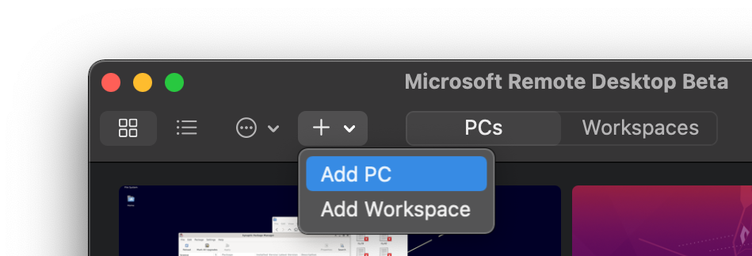
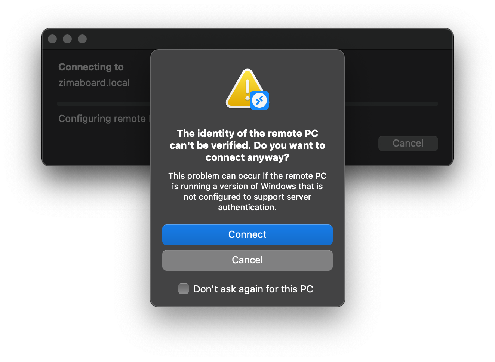
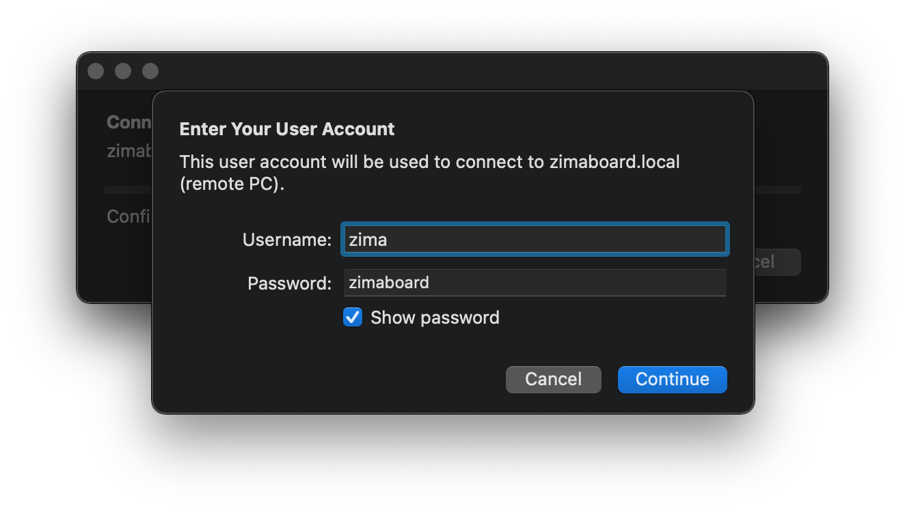

# Try It!

We will using remote desktop via Xrdp to login in

::: details Want to use SSH? 

```
host: zimaboard.local
user: zima
password: zimaboard
```

:::

## Download MS Remote Desktop

| Client | Get the app | Documentation |
|-----------------|---------------------|-------------|
| Windows Desktop | [Windows Desktop client](https://docs.microsoft.com/en-us/windows-server/remote/remote-desktop-services/clients/windowsdesktop#install-the-client) | [Get started](https://docs.microsoft.com/en-us/windows-server/remote/remote-desktop-services/clients/windowsdesktop) |
| Microsoft Store | [Windows 10 client in the Microsoft Store](https://go.microsoft.com/fwlink/?LinkID=616709) | [Get started](https://docs.microsoft.com/en-us/windows-server/remote/remote-desktop-services/clients/windows) |
| Android         | [Android client in Google Play](https://play.google.com/store/apps/details?id=com.microsoft.rdc.androidx) | [Get started](https://docs.microsoft.com/en-us/windows-server/remote/remote-desktop-services/clients/remote-desktop-android) |
| iOS             | [iOS client in the App Store](https://apps.apple.com/app/microsoft-remote-desktop/id714464092) | [Get started](https://docs.microsoft.com/en-us/windows-server/remote/remote-desktop-services/clients/remote-desktop-ios) |
| macOS           | [macOS client in the App Store](https://apps.apple.com/app/microsoft-remote-desktop/id1295203466?mt=12) | [Get started](https://docs.microsoft.com/en-us/windows-server/remote/remote-desktop-services/clients/remote-desktop-mac) |
| macOS Beta      | [macOS Beta client in MS AppCenter ](https://install.appcenter.ms/orgs/rdmacios-k2vy/apps/microsoft-remote-desktop-for-mac/distribution_groups/all-users-of-microsoft-remote-desktop-for-mac) | [Get started](https://docs.microsoft.com/en-us/windows-server/remote/remote-desktop-services/clients/remote-desktop-mac) |

> Learn more about the different Microsoft remote desktop apps at: [here](https://aka.ms/rdapps)

## Remote Access via MS Remote Desktop

1. Click Add PC




2. Setting


3. Double click on the added PC to start the connection

During the process, the following prompt box may pop up



Juts click the "Connect" button


4. Enter User Account



Then click "Connect" button


5. Debian System Authenticate


Type in "zimaboard" and click the "Authenticate" button


6. Done!


You have successfully entered ZimaBoard's system!