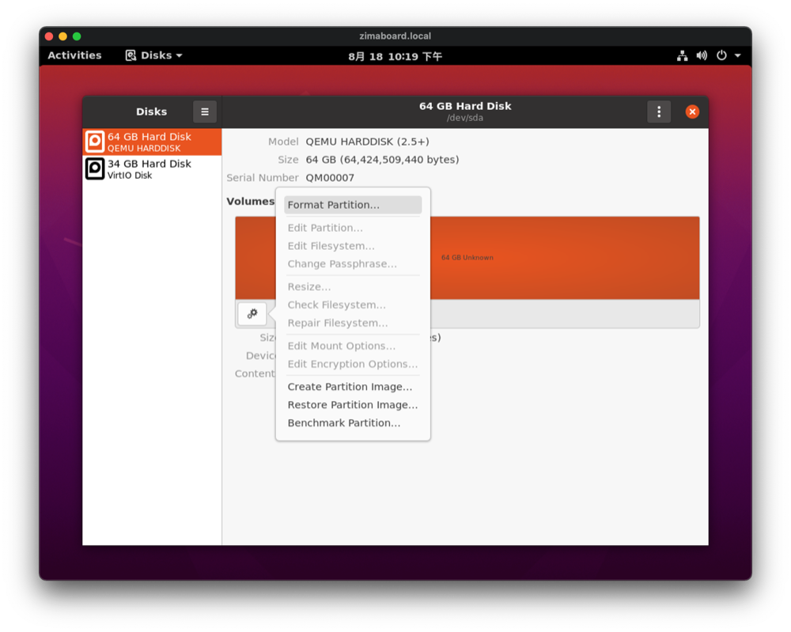
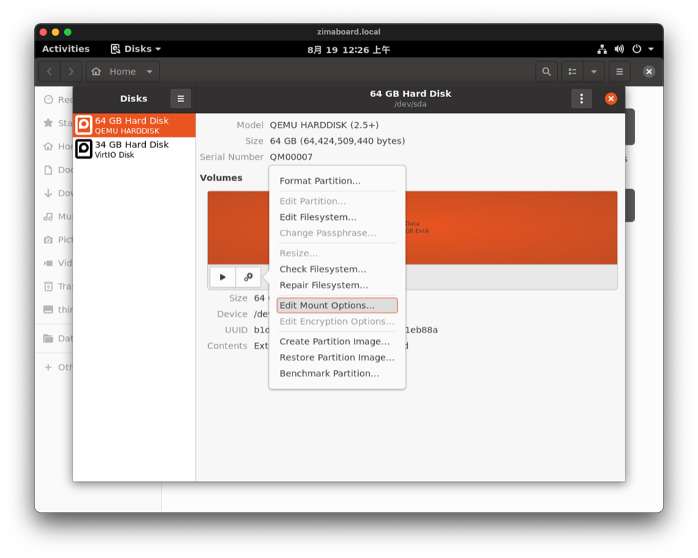
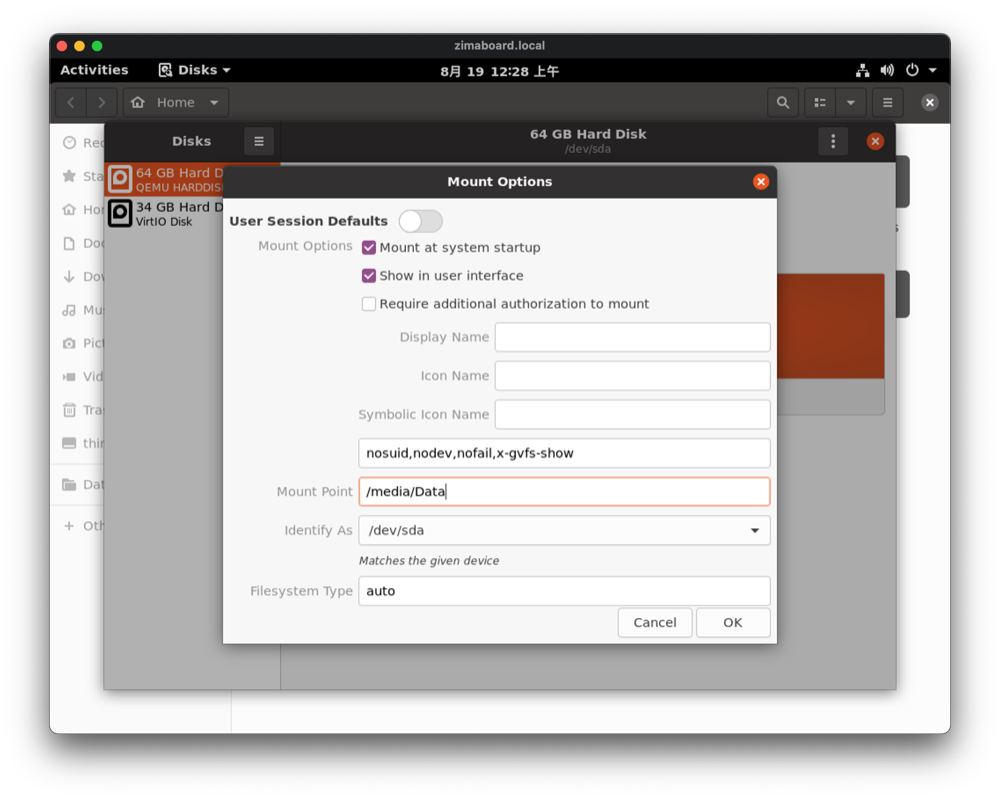
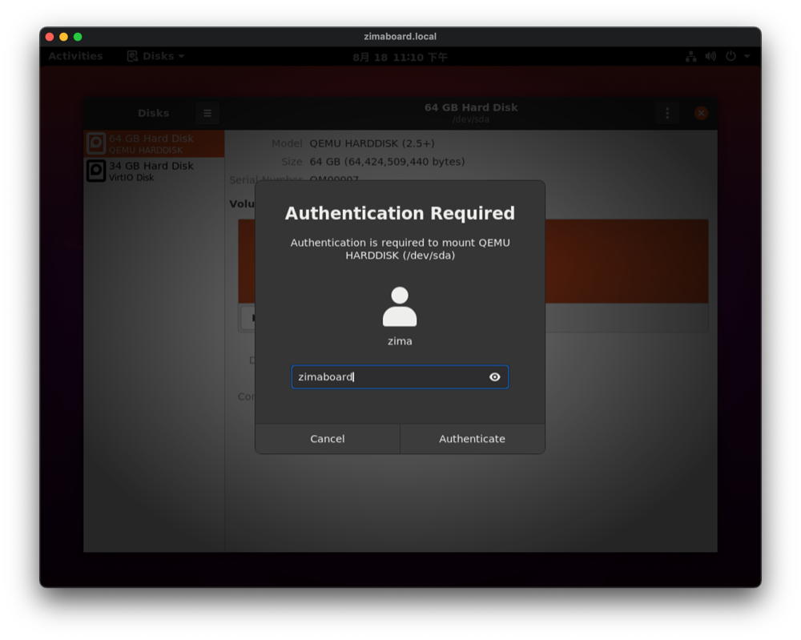

# Setup the Disk

## Open "Disks" application

Search for "Disks" in the "Activities" in the upper left corner of the desktop and open it.

On the left side, select the disk with a capacity and model similar to the one you need to configure.

## Formatting the disk

::: warning

Make sure you no longer need the data on the disk before formatting it.

Skip this paragraph if you want to mount the disk without formatting it.

:::

If this is a brand new disk, or if you no longer need the data inside, then let's start formatting it.

Refer to the picture below and fill in the disk information, the volume name can be changed at will.

Confirm the information and click "Format".

Enter the password and click "Authenticate".

Next you can have a cup of tea or coffee and wait for the formatting to finish.

Once that's done you'll see a play button appear in the "Volumes" area.

## Mount Partion

Click the gear icon, then click "**Edit Mount Options...**"

Turn off the "User Session Defaults" option.

Fill in "/media/Data" in the "Mount Point" field, and click OK.

Click this play button to "Mount selected partion"

Enter the password and click "Authenticate".

After authorization, the disk is mounted and finished.

You will see below the volume area, you can see the "**Contents**".

Here it says "Mounted at /media/Data".

Click on "/media/Data" and you will be able to open the mounted disk.

## Add to Bookmarks

To make it easier for us to find this disk quickly next time, here we add it to the bookmarks.

This way we will be able to find it quickly in the sidebar of the file manager.

