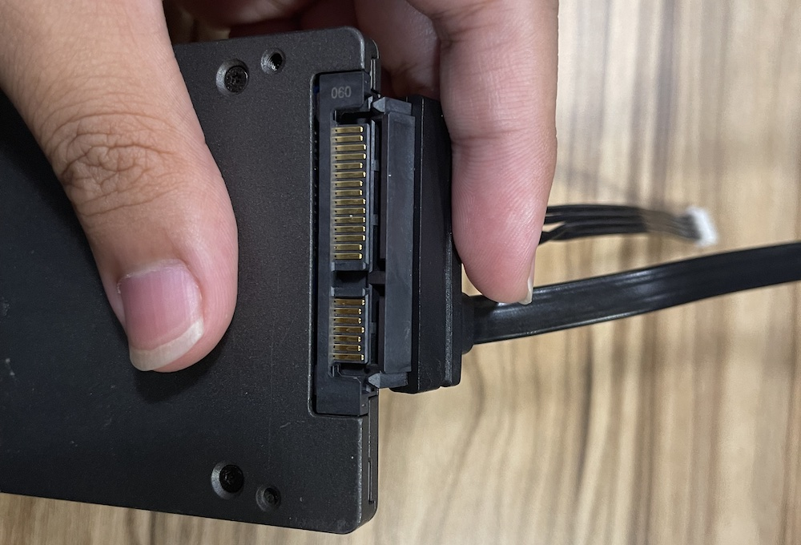
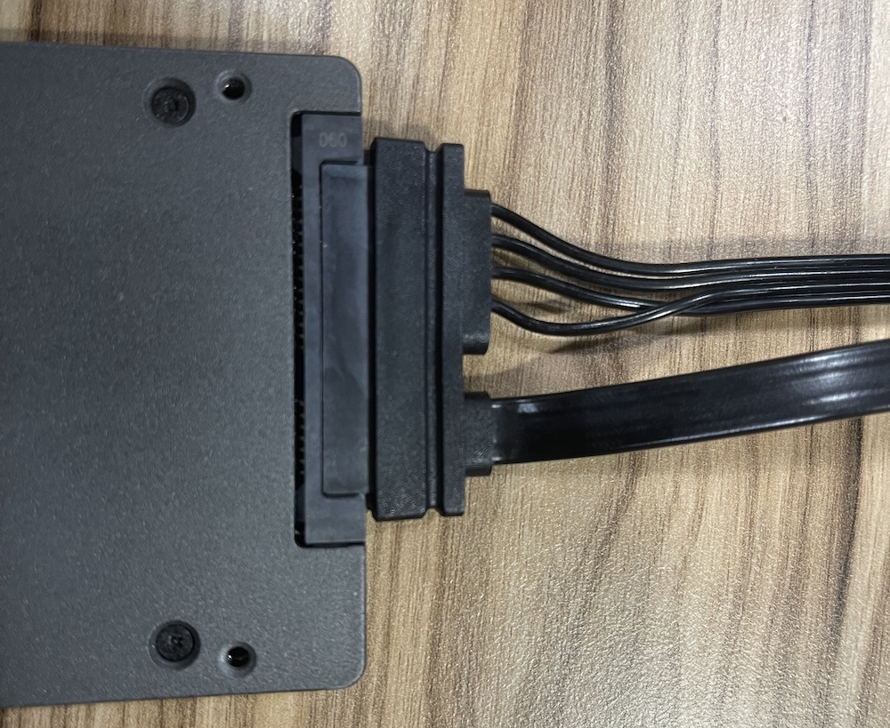
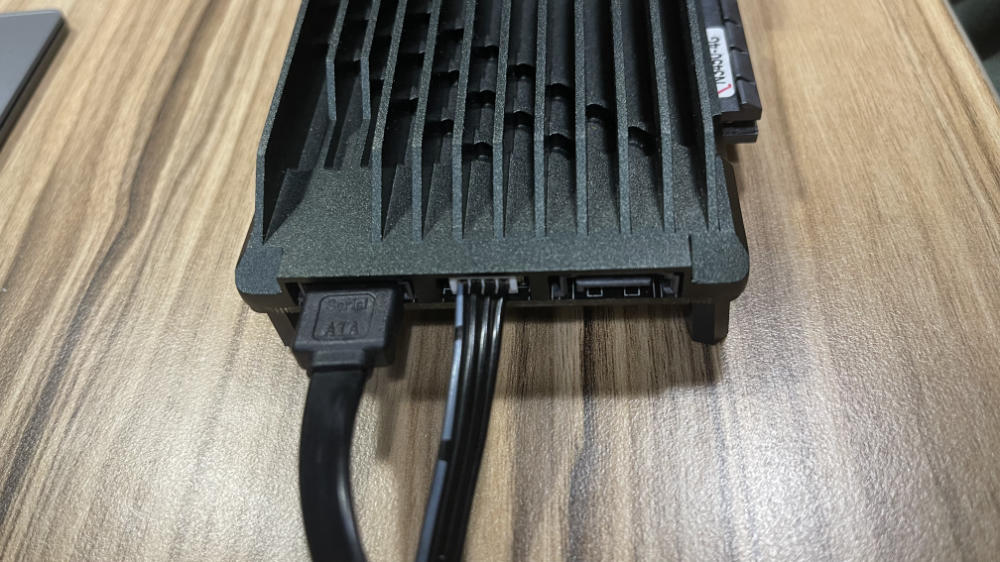

# Connecting

## Connect Hard Disk

::: warning
Please do this operation with the power off.
:::

Connecting the SATA cable to the disk

Connecting the SATA cable to the ZimaBoard

## Power Up!

Connect the Ethernet cable and power adapter to the power port as shown above.

The other end of the Ethernet cable needs to be connected to your router.