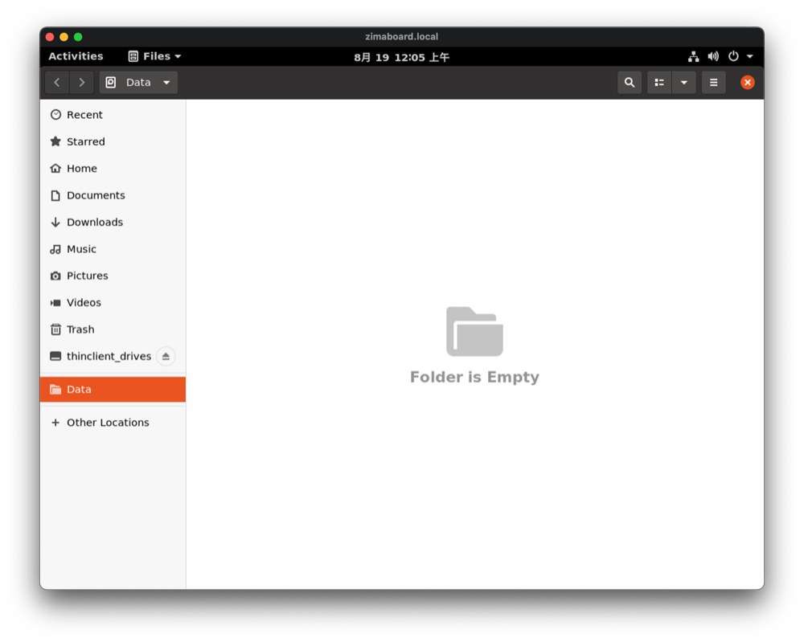
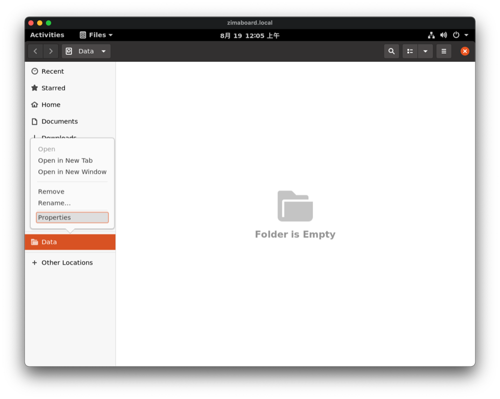
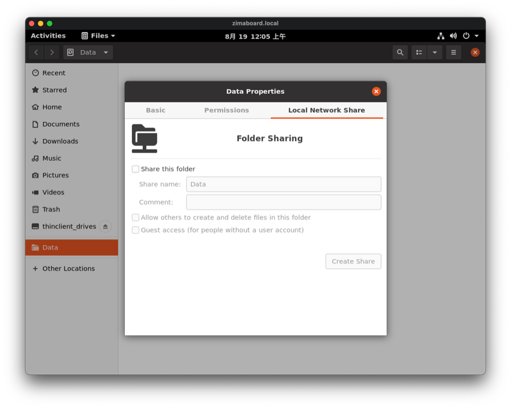
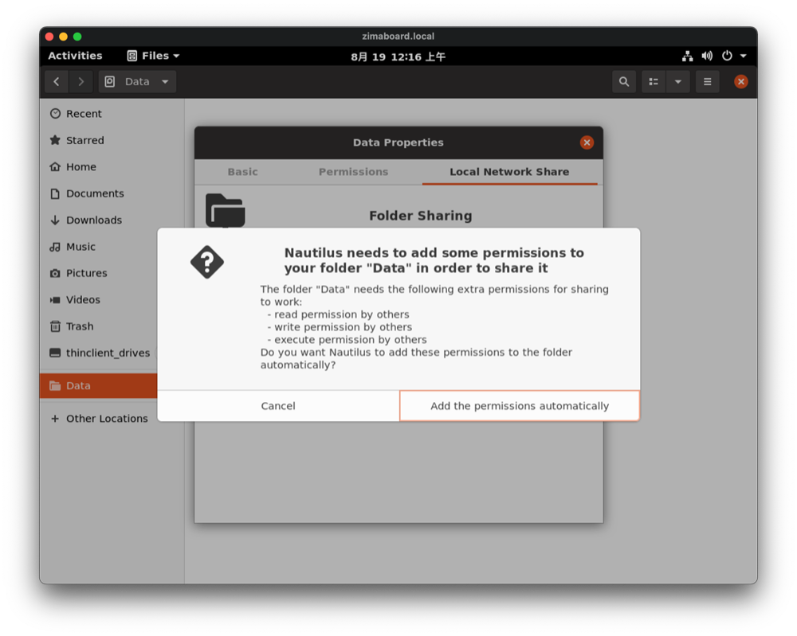
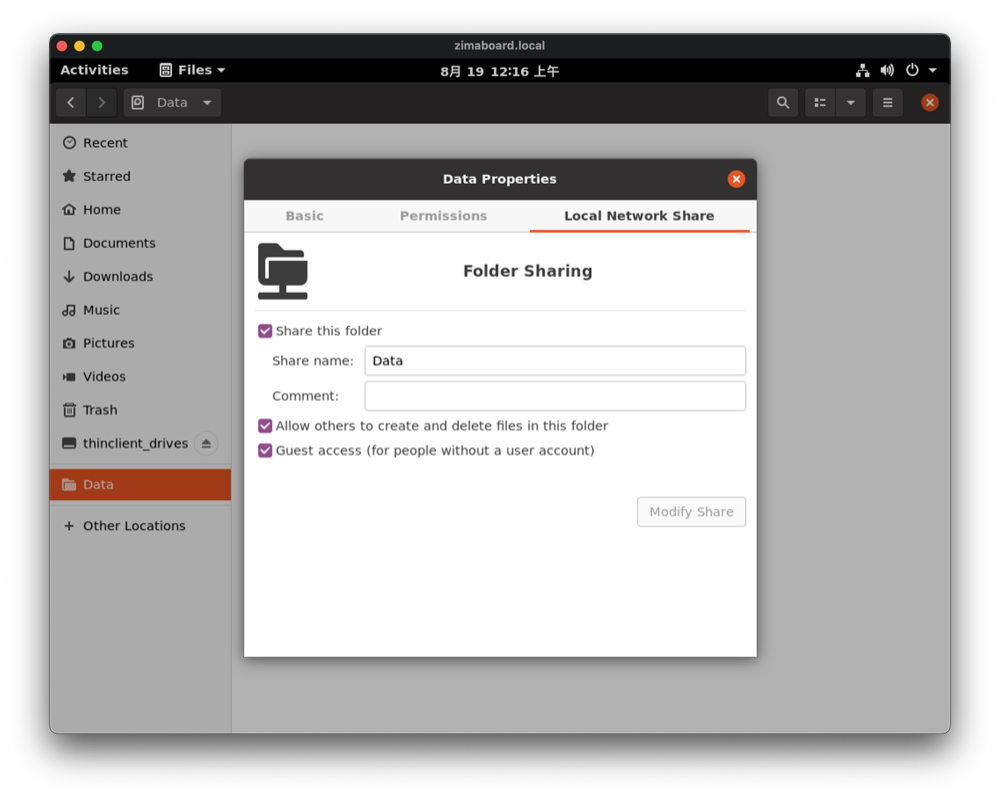

# Share the Disk

::: details Want to configure Samba directly using the command line?

This tutorial from Ubuntu is a good one to refer to.

[Ubuntu Tutorials - Install and Configure Samba](https://ubuntu.com/tutorials/install-and-configure-samba)

:::

## Open the Disk

Open the disk you want to set up for sharing

## Create Share

Right-click on the disk you want to share, and click "**Properties**".

Select the "**Local Network Software**" tab.

Check the boxs, and Click "**Create Share**"

Click "**Add the permissions automatically**"

Done!

