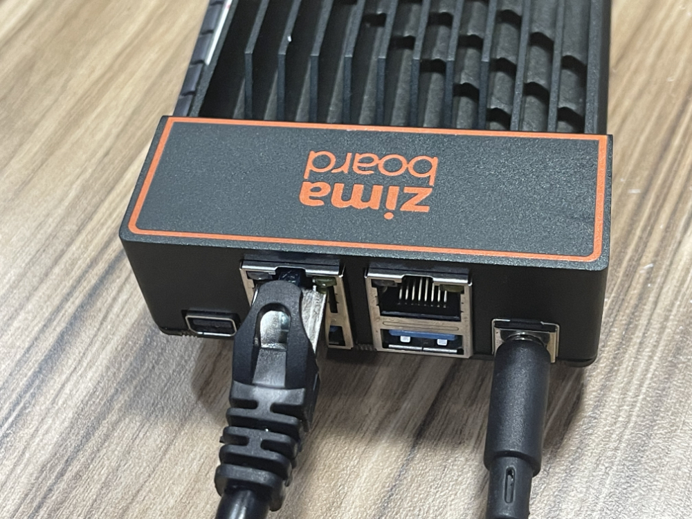

# 插线，开机！

## Connect Ethernet

Connect the Ethernet cable to the Ethernet port as shown above.

The other end of the Ethernet cable needs to be connected to your router

## Power Up!

Connect the power adapter to the power port as shown above.