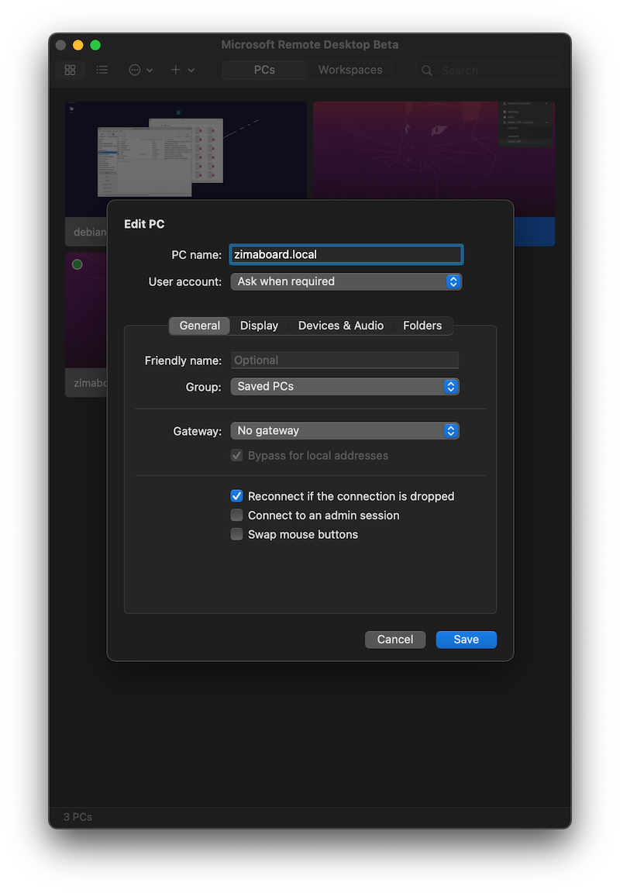
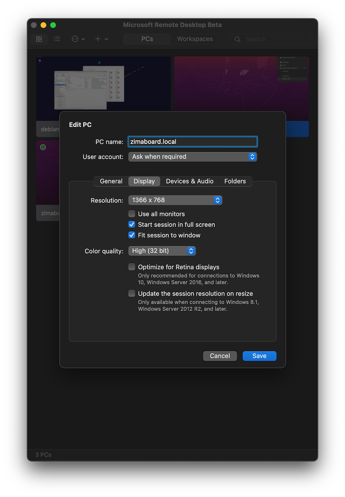
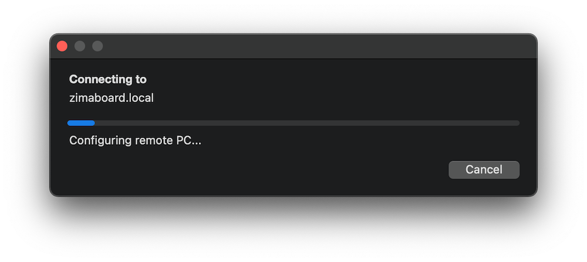
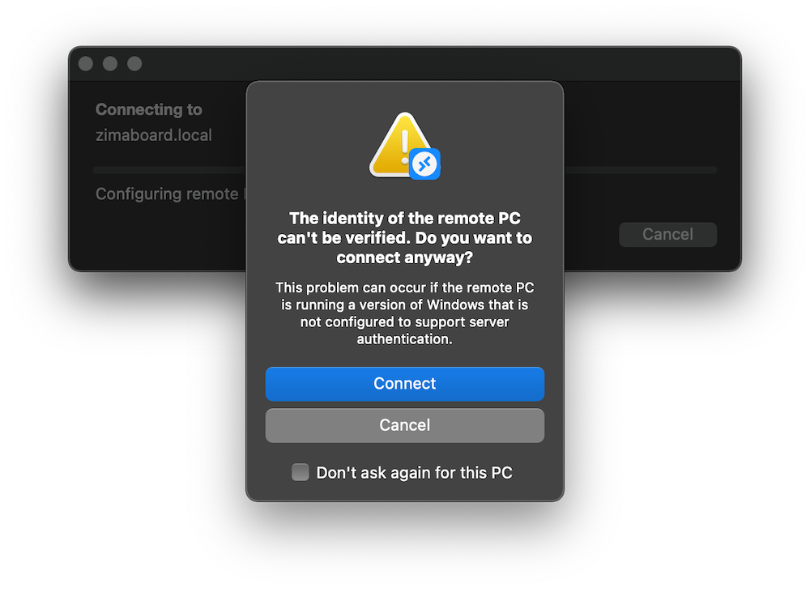
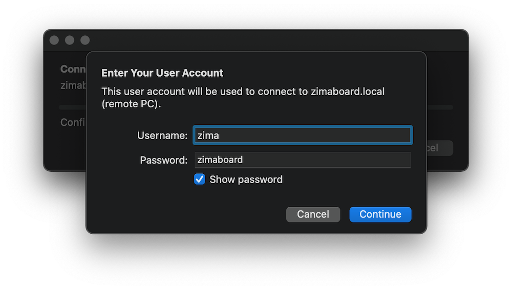

# 远程连接你的服务器桌面

In this section we will access the ZimaBoard's system remotely.

::: details Want to use SSH directly? 

```:no-line-numbers
host: zimaboard.local
----------------------
user: zima
password: zimaboard
```

:::

## 下载远程桌面客户端

| 客户端 | 下载地址 | 文档 |
|-----------------|---------------------|-------------|
| Windows Desktop | [Windows Desktop client](https://docs.microsoft.com/en-us/windows-server/remote/remote-desktop-services/clients/windowsdesktop#install-the-client) | [Get started](https://docs.microsoft.com/en-us/windows-server/remote/remote-desktop-services/clients/windowsdesktop) |
| Microsoft Store | [Windows 10 client in the Microsoft Store](https://go.microsoft.com/fwlink/?LinkID=616709) | [Get started](https://docs.microsoft.com/en-us/windows-server/remote/remote-desktop-services/clients/windows) |
| Android         | [Android client in Google Play](https://play.google.com/store/apps/details?id=com.microsoft.rdc.androidx) | [Get started](https://docs.microsoft.com/en-us/windows-server/remote/remote-desktop-services/clients/remote-desktop-android) |
| iOS             | [iOS client in the App Store](https://apps.apple.com/app/microsoft-remote-desktop/id714464092) | [Get started](https://docs.microsoft.com/en-us/windows-server/remote/remote-desktop-services/clients/remote-desktop-ios) |
| macOS           | [macOS client in the App Store](https://apps.apple.com/app/microsoft-remote-desktop/id1295203466?mt=12) | [Get started](https://docs.microsoft.com/en-us/windows-server/remote/remote-desktop-services/clients/remote-desktop-mac) |
| macOS Beta      | [macOS Beta client in MS AppCenter ](https://install.appcenter.ms/orgs/rdmacios-k2vy/apps/microsoft-remote-desktop-for-mac/distribution_groups/all-users-of-microsoft-remote-desktop-for-mac) | [Get started](https://docs.microsoft.com/en-us/windows-server/remote/remote-desktop-services/clients/remote-desktop-mac) |

> 你可以在[这里](https://aka.ms/rdapps)了解到更多有关微软远程桌面客户端的详情

## Remote Access via MS Remote Desktop

1. **Click Add PC**


2. **Setting**

General Setting:



Display Setting:

(Smaller resolution will help improve speed during remote access)




3. **Connecting**

Double click on the added PC to start the connection



During the process, the following prompt box may pop up



Juts click the "Connect" button


4. **Enter User Account**



Then click "Connect" button


5. **Ubuntu System Authentication**


Type in "zimaboard" and click the "Authenticate" button


6. **Done!**


You have successfully entered ZimaBoard's system!