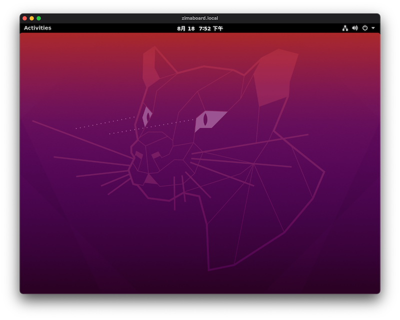

# 远程连接服务器桌面

在这一步里我们将会使用远程桌面连接到你的服务器桌面～

::: details 想要直接使用 SSH ？
```:no-line-numbers
主机名: zimaboard.local
----------------------
用户: zima
密码: zimaboard
```
:::


## 下载远程桌面客户端

| 客户端 | 下载地址 | 文档 |
|-----------------|---------------------|-------------|
| Windows Desktop | [Windows Desktop client](https://docs.microsoft.com/en-us/windows-server/remote/remote-desktop-services/clients/windowsdesktop#install-the-client) | [Get started](https://docs.microsoft.com/en-us/windows-server/remote/remote-desktop-services/clients/windowsdesktop) |
| Microsoft Store | [Windows 10 client in the Microsoft Store](https://go.microsoft.com/fwlink/?LinkID=616709) | [Get started](https://docs.microsoft.com/en-us/windows-server/remote/remote-desktop-services/clients/windows) |
| Android         | [Android client in Google Play](https://play.google.com/store/apps/details?id=com.microsoft.rdc.androidx) | [Get started](https://docs.microsoft.com/en-us/windows-server/remote/remote-desktop-services/clients/remote-desktop-android) |
| iOS             | [iOS client in the App Store](https://apps.apple.com/app/microsoft-remote-desktop/id714464092) | [Get started](https://docs.microsoft.com/en-us/windows-server/remote/remote-desktop-services/clients/remote-desktop-ios) |
| macOS           | [macOS client in the App Store](https://apps.apple.com/app/microsoft-remote-desktop/id1295203466?mt=12) | [Get started](https://docs.microsoft.com/en-us/windows-server/remote/remote-desktop-services/clients/remote-desktop-mac) |
| macOS Beta      | [macOS Beta client in MS AppCenter ](https://install.appcenter.ms/orgs/rdmacios-k2vy/apps/microsoft-remote-desktop-for-mac/distribution_groups/all-users-of-microsoft-remote-desktop-for-mac) | [Get started](https://docs.microsoft.com/en-us/windows-server/remote/remote-desktop-services/clients/remote-desktop-mac) |

> 你可以在[这里](https://aka.ms/rdapps)了解到更多有关微软远程桌面客户端的详情


## 创建远程桌面连接

1. **创建PC**


2. **设置**

General 设置:


Display 设置:

(小点的分辨率可以让连接速度更快)


3. **连接**

双击刚刚创建的PC开始连接


在远程连接的过程中可能会跳出下面的提示框


直接点击“Connect”就好了


4. **输入用户名**

按下图输入用户名密码，然后点击连接即可。


5. **Ubuntu 系统授权**

进入系统后可能会跳出如下图所示的授权提示：


输入密码“zimaboard”，然后点击“Authenticate”按钮就好了。


6. **搞定！**



现在就已经成功进入系统桌面了。

现在，你就拥有一个完整版的 Ubuntu 系统了。

