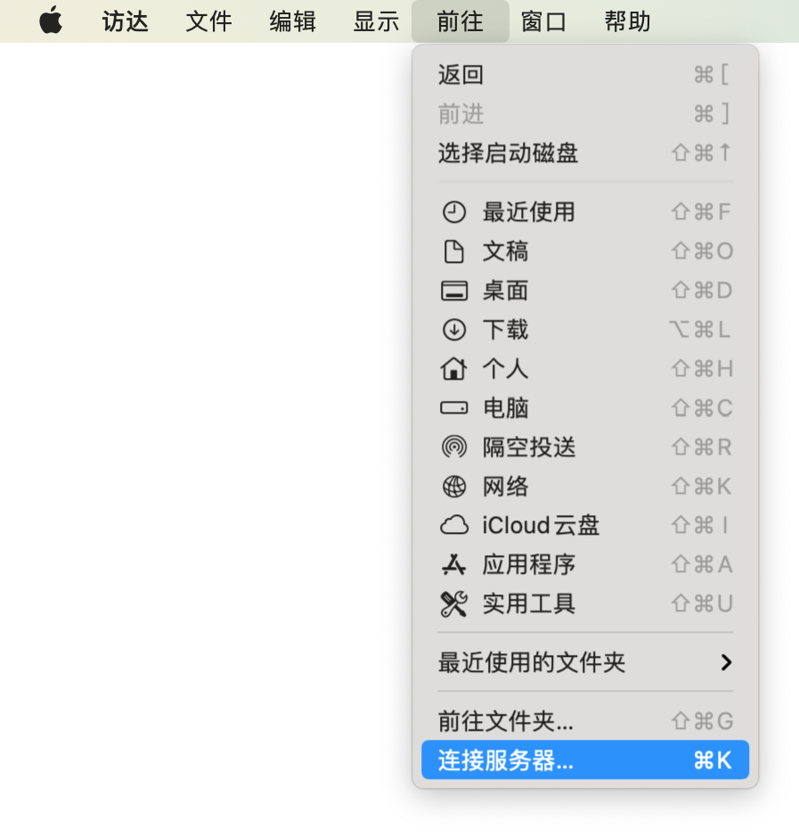
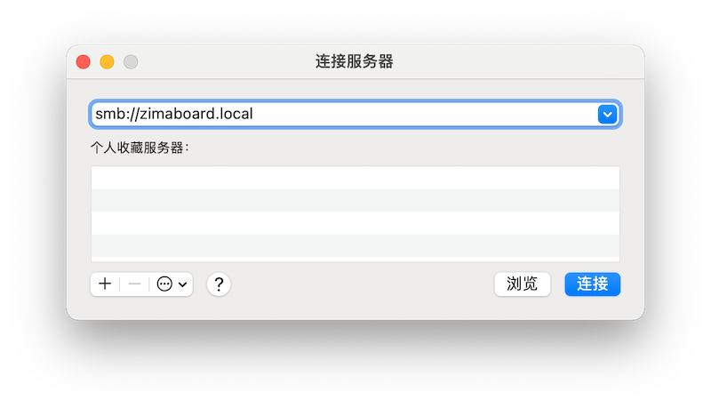
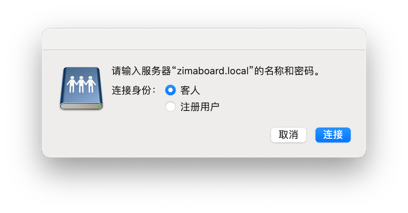
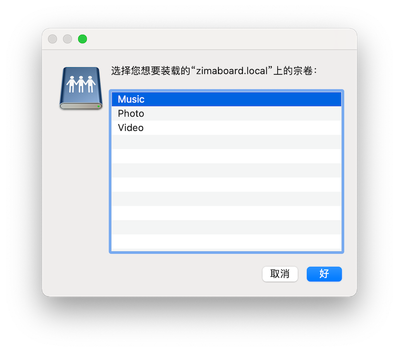
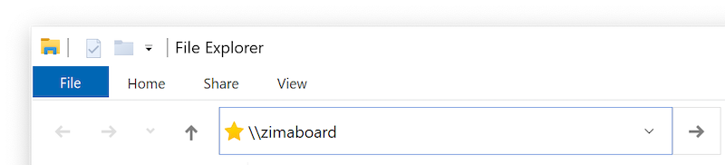
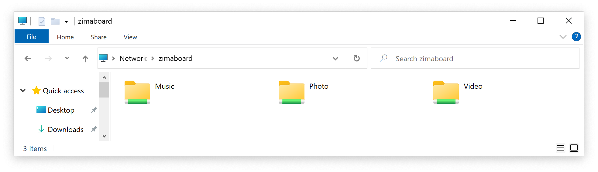

# 连接到共享文件夹

## macOS
在 **访达(Finder)** 的菜单中, 依次点击 **前往** > **连接到服务器…**  

输入`smb://zimaboard.local`，点击“**连接**”

选择连接身份，这里我们直接选择“**客人**”，然后点击“**连接**”

接下来选择你想要连接的文件夹就好了

## Windows

打开 **文件管理器** 在地址栏中输入`\\zimaboard`

按下<kbd>Enter</kbd>后，你就能看到 ZimaBoard 上的共享文件啦

::: tip

本地网络上的所有设备以“客人(guest)”都可以使用这个共享磁盘。

:::