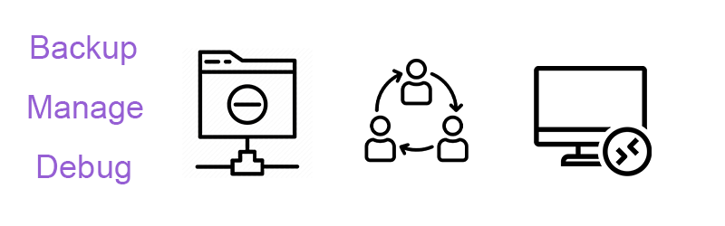

# 初见家庭服务器

相信你已经看到了， **ZimaBoard** 世界上第一个**单板服务器**(Single Board Server)。

那么你的服务器该怎么玩呢？让我们一起来上手体验一下！

## 你会了解到什么

- 接线并开启 ZimaBoard
- 远程访问你的服务器桌面
- 内网文件共享
- 体验Nextcloud私有云
- 用Emby管理你的影音资源

## 你需要准备什么

<!-- 

 -->

  
  
  

- 1 x ZimaBoard 216/432/832
- 1 x 电源适配器
- 1 x 网线