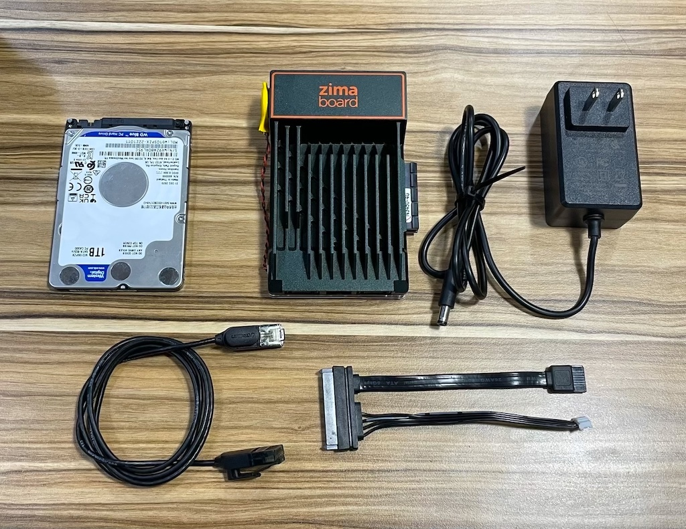
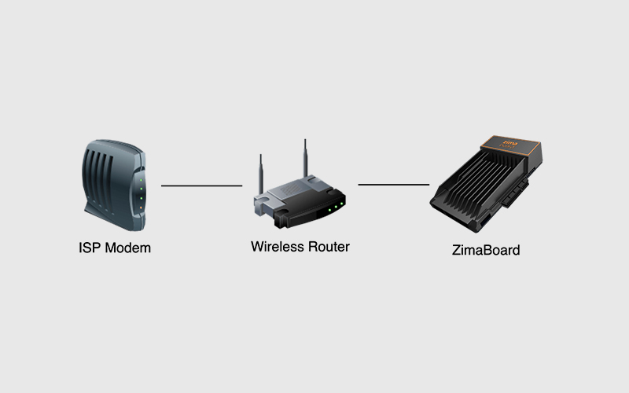
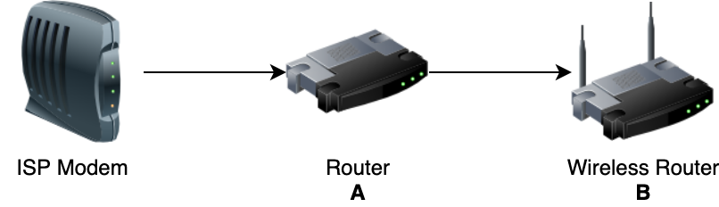
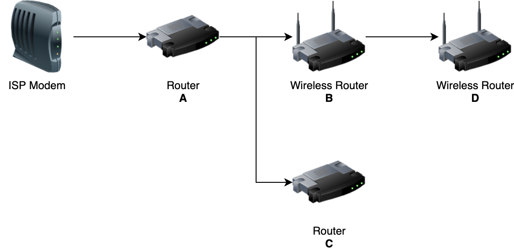
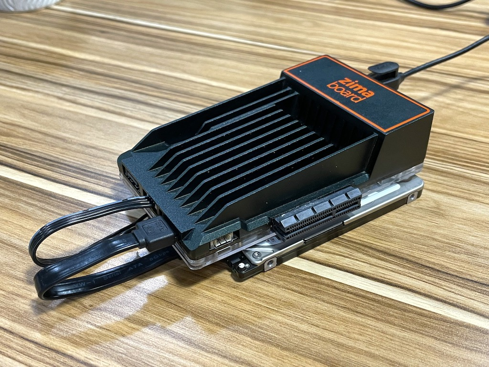
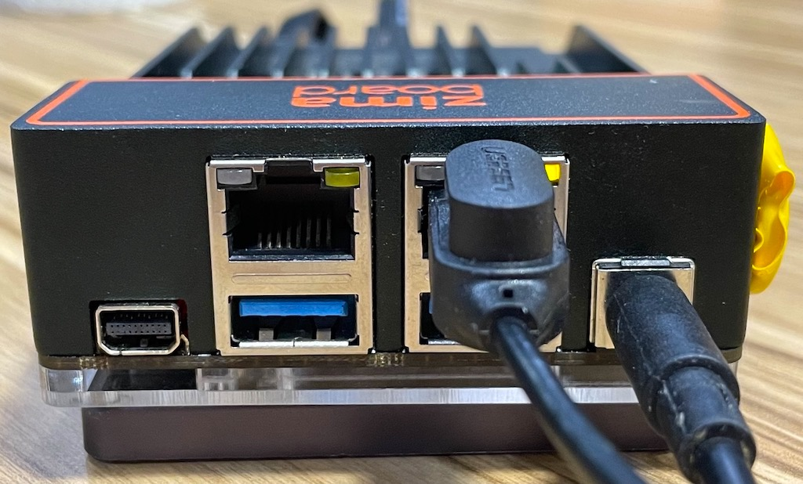

# 初见家庭服务器

不论你是专家还是新手，快速上手教程将带你熟悉ZimaBoard的基础硬件规格、预制的家庭服务器基本应用，和调试与开发的一些基础的账号权限系统等。
通过这个简短的教程，你将在15分钟内，搭建起你家全新的一台个人数据中心。这就让我们开始吧！

## 总览

- ZimaBoard上电开机
- 发现与访问共享盘（Samba）
- 体验Nextcloud私有云
- 用Emby管理你的影音资源

## 硬件筹备

<!-- 

  
  
  

 -->

- ZimaBoard 
- 12v3A 电源适配器
- 超5类或更高规格网线
- SATA Cable for ZimaBoard
- 2.5" SATA SSD or HDD

::: tip
不需要像鼠标键盘和显示屏接入ZimaBoard，一通繁琐的接线，你可以直接通过网络访问ZimaBoard上所有服务。
当然，如果你觉得接插显示屏更为便捷，也可以配上miniPD转HDMI线和鼠键。
:::

## 接线与上电

1. 先接配件再上电是基本礼仪，推荐将ZimaBoard通过网线接入到你的路由器或者光猫下，参考该图

::: warning

如果你的网络里有多个路由器，请确保将 ZimaBoard 接入到你的主路由器下。或者至少接入到你用来访问设备的同级路由器。

简单来说，尽量接到最上层的路由器就好了！

::: details

**举个例子如果你的网络是这种情况：**

路由器的连接关系如图所示，A路由器和B路由器都连接着不同的上网设备，你希望他们都能连接到 ZimaBoard 的话，请将 ZimaBoard 连接到A路由器。

但是如果你的所有上网设备实际上都连接到B路由器上，或者说你只希望B路由器下的设备访问到 ZimaBoard ，那就连接到B路由器上就可以了。

---

**下面这种网络情况也是一样：**

路由器的连接关系如图所示，A、B、C、D路由器都连接着不同的上网设备，你希望他们都能连接到 ZimaBoard 的话，请将 ZimaBoard 连接到A路由器。

如果你只希望B路由器下的设备访问到 ZimaBoard ，那就连接到B路由器上就可以了。这个时候，连接到A、C路由器的设备都访问不到 ZimaBoard 了。

:::

2.  **先不上电！** 一张图到位，硬件接线图如下

3. 插上电源线，网络指示灯闪烁！(ง ͡ʘ ͜ʖ ͡ʘ)ง

::: warning
网络指示灯正常闪烁，即系统已经正常上电，请耐心等待10-15秒左右！如果没有接插外部磁盘，系统启动可能略长。
:::

系统已启动， 下一步！
