# 通过电脑和手机访问共享盘

## 简要背景

ZimaBoard预制了Samba服务，它是一种常用的局域网内共享文件和打印机的一种通信协议。
所以，ZimaBoard启动后，不论是你家里的笔记本，手机，路由器，还是大电视都能在局域网内自动发现Samba创造的共享文件夹。
当然，所有预制的脚本，只是简单配置了ZimaBoard文件系统中的部分共享区域，如有你需要进阶需求，可以查看[Samba延生配置资料]()

## 电脑访问ZimaBoard共享盘

### MacOS访问

#### 自发现局域网磁盘

1. 打开MacOS系统的Finder（访达）

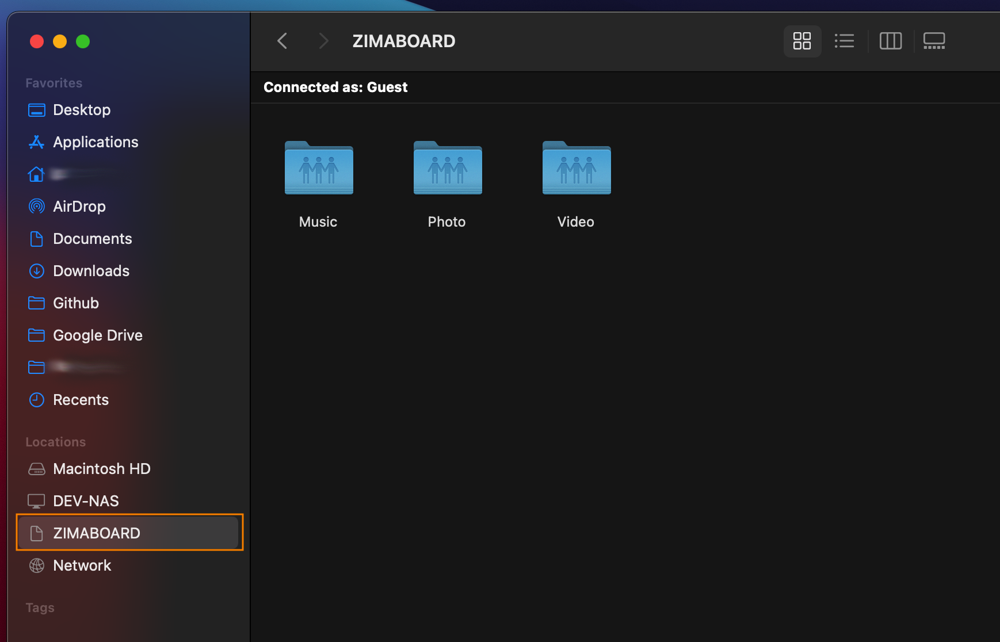

2. 点击该设备，以guest（访客）模式登陆即可看到ZimaBoard默认共享的3个文件夹

3. 播放Samba共享盘中的4K影片，✌.|•͡˘‿•͡˘|.✌

::: tip
以下是这些共享文件夹在ZimaBoard中默认挂载的位置
 - Music：/media/Volume1/Music
 - Video：/media/Volume1/Video
 - Photo：/media/Volume1/Photo

你可以通过/etc/samba/smb.config对共享文件夹路径和名称进行再配置，详细内容参考[Samba延生配置资料]()
:::

#### MacOS手动接入

1. 在 **访达(Finder)** 的菜单中, 依次点击 **前往** > **连接到服务器…**  

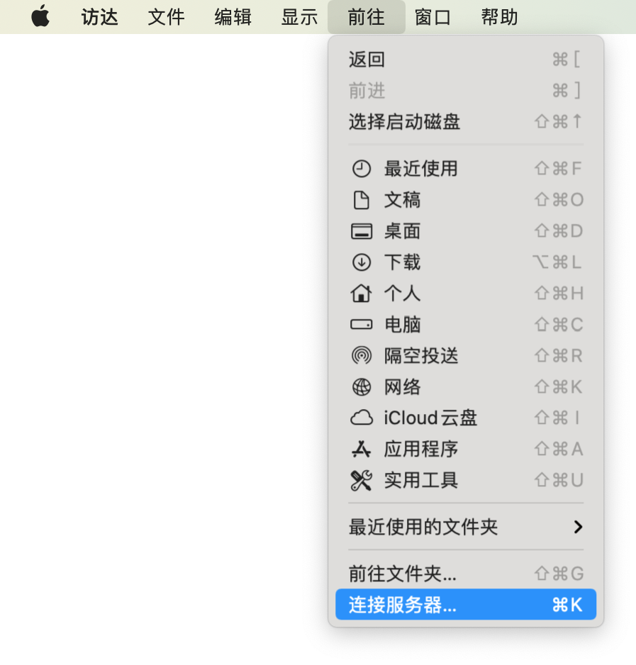

2. 输入`smb://zimaboard.local`，点击“**连接**”

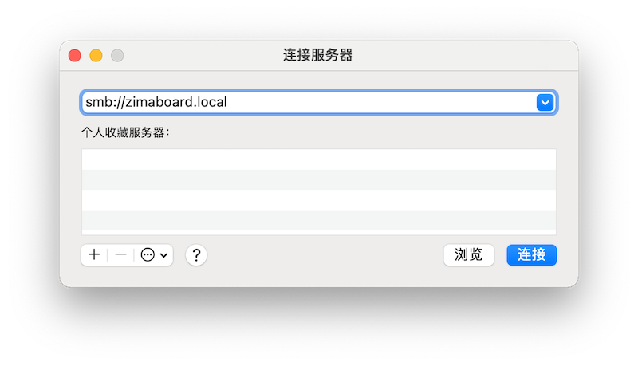

3. 选择连接身份，这里我们直接选择“**客人**”，然后点击“**连接**”

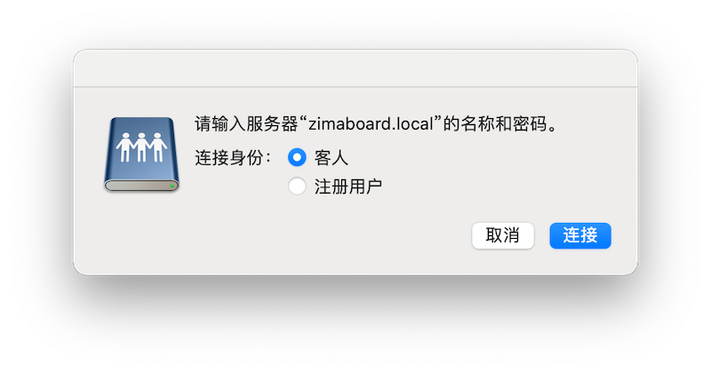

4. 接下来选择你想要连接的文件夹就好了

### Windows访问

1. 打开 **文件管理器** 在地址栏中输入`\\zimaboard`

2. 按下<kbd>Enter</kbd>后，你就能看到 ZimaBoard 上的共享文件啦

::: tip
本地网络上的所有设备都可以“客人(guest)”身份使用这些共享文件夹。
:::

## 手机访问ZimaBoard共享盘

### iOS访问

1. 在iOS中，下拉，搜索files，登陆iOS官方应用
   
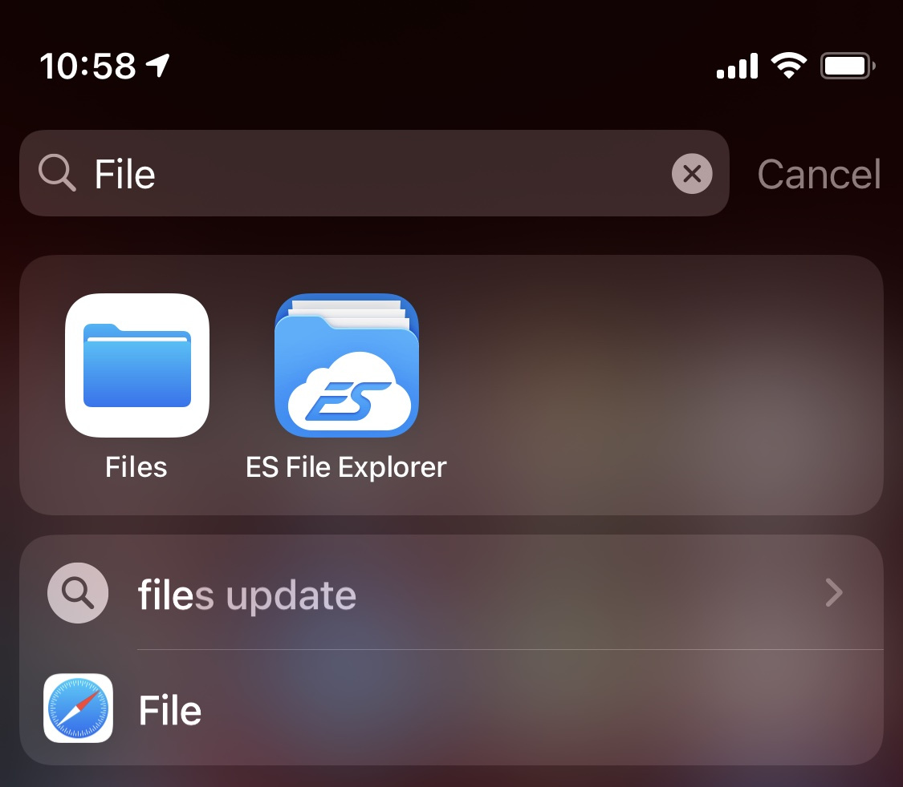

2. 点击右上角按钮，找到Connect to Server按钮，点击登陆
   
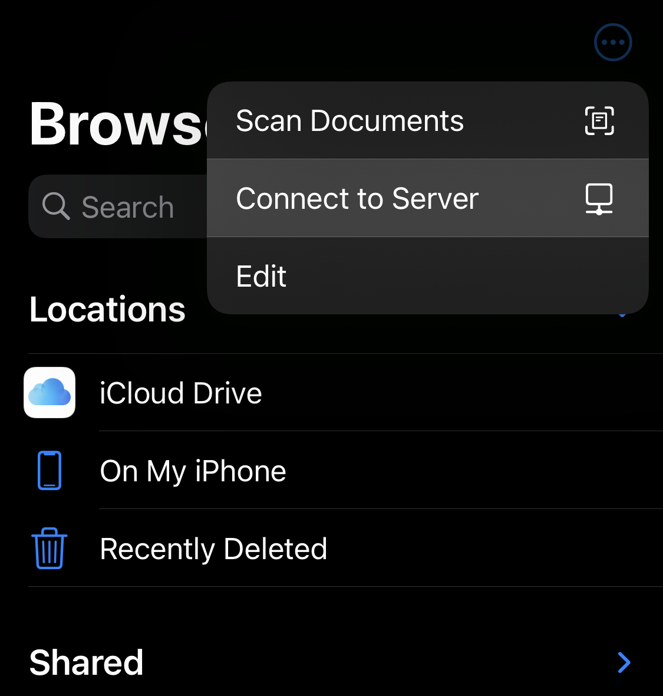

3. 输入mDNS域名（ZimaBoard默认设备域名） - zimaboard.local，或者通过[路由器查看了解ZimaBoard对应的ip地址]()(知识库教程)

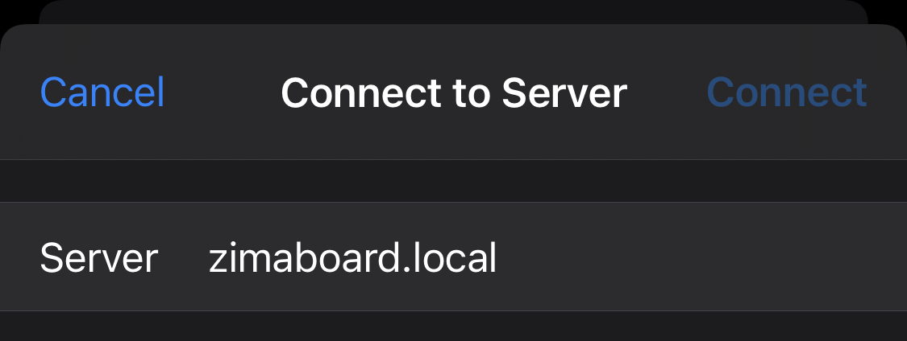

4. 以访客模式登陆（默认Samba配置）

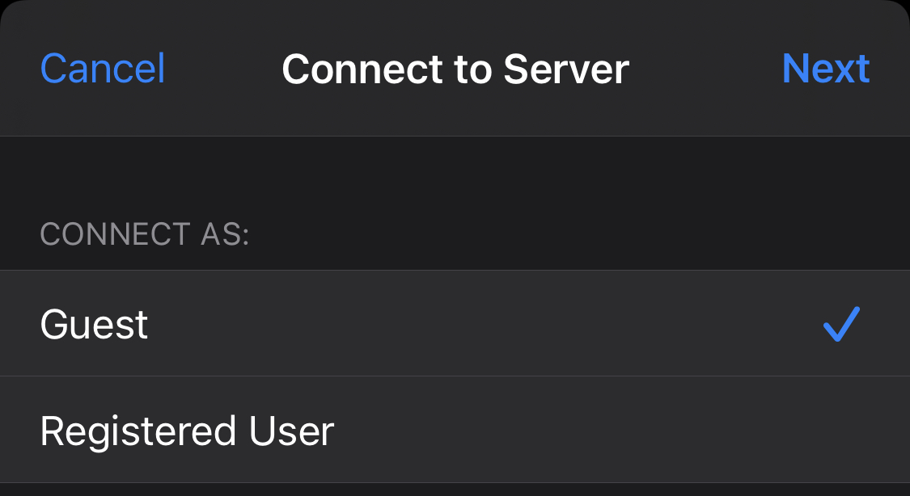

5. 成功登陆并访问所有文件与媒体内容

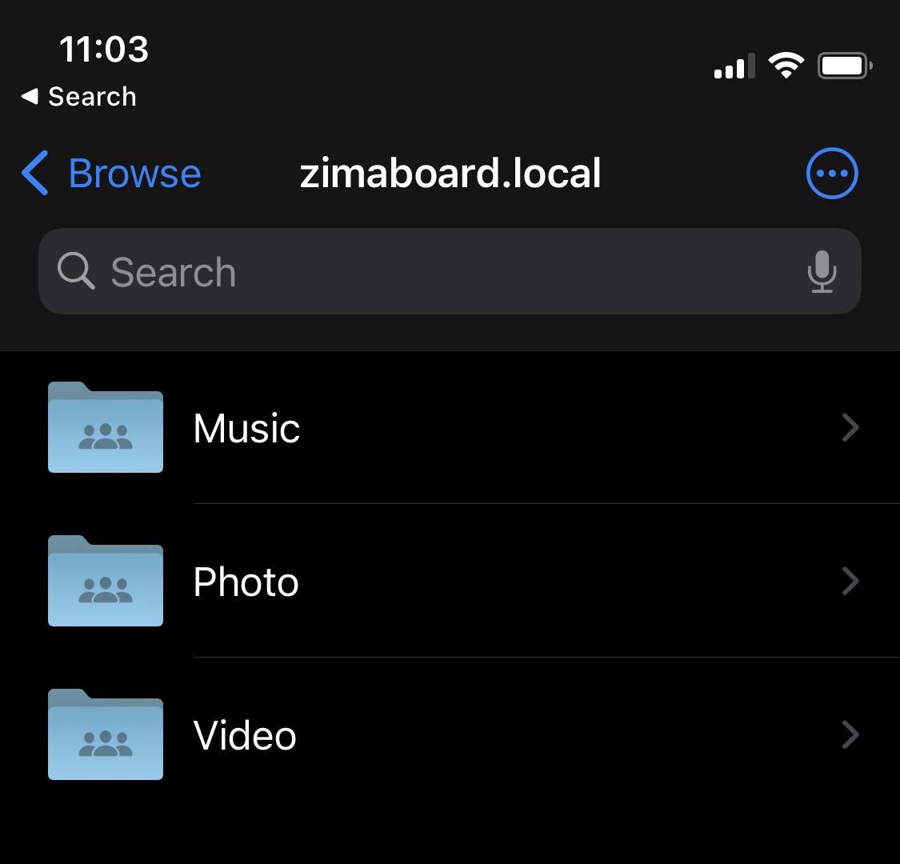

### Android访问

在 Android 手机中，我们测试了多个文件管理器(ES文件浏览器、小米文件浏览器、文件极客、CX文件管理器等等)。

我们推荐使用"**CX文件管理器**"，这是一个小而美，无广告，可以方便的连接多种类型的共享盘的文件管理器。

下载：
[直接下载 apk 安装包](https://www.apkmirror.com/apk/cx-file-explorer/)，
[通过 Google Play 下载](https://play.google.com/store/apps/details?id=com.cxinventor.file.explorer)

0. 一图看完

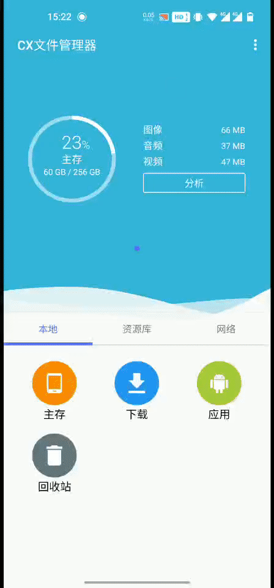

1. 打开 CX 文件管理器

2. 在页面下方选择"**网络**"，选择"**新位置**"

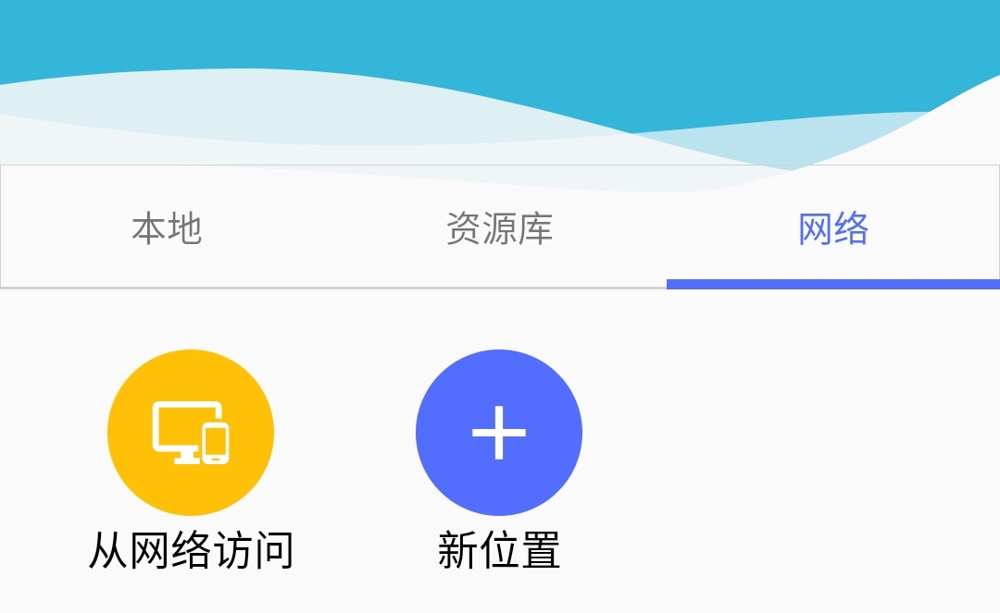

3. 在弹出的对话框中选择"**远程存储**"页面，选择"**SMB**"选项

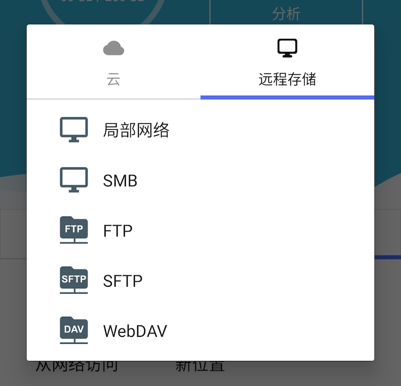

4. 在主机中输入`zimaboard`，勾选"**匿名**"选项，然后点击确定。

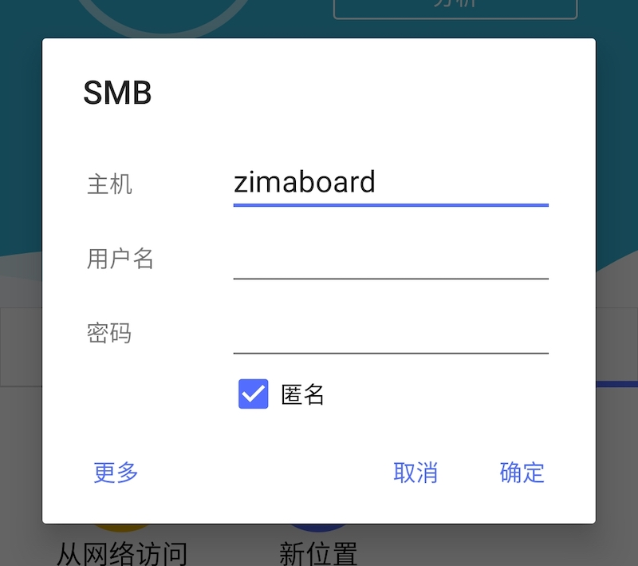

5. 接下来就可以访问共享盘中的文件啦！

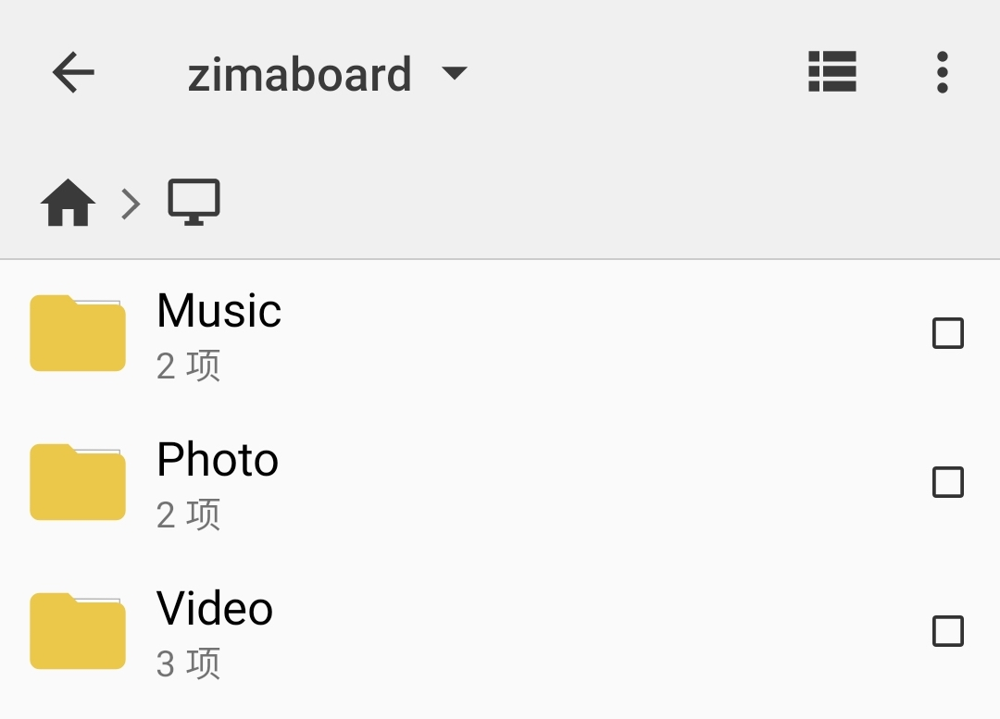

---

到这，我就挺想[通过远程登录的方式]()，访问家庭服务器中的资料（对应教程开发中...）

