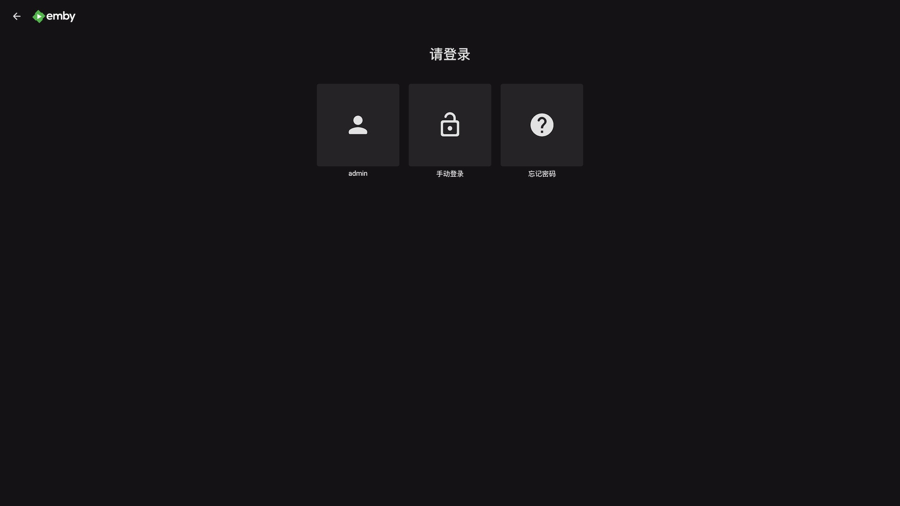
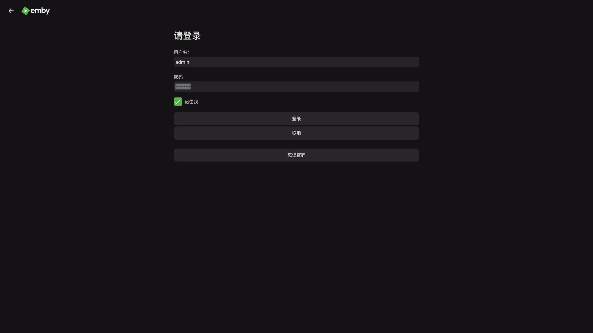
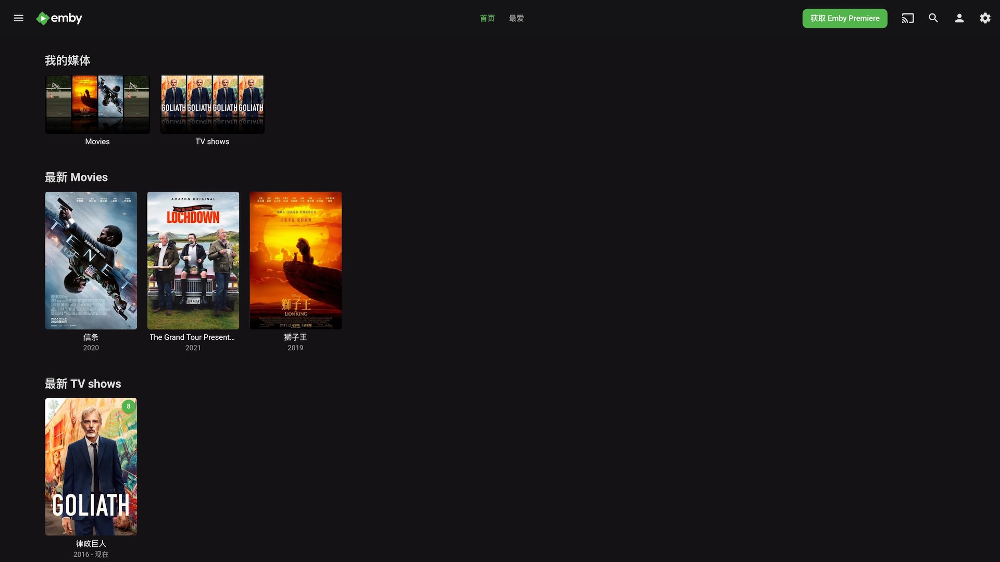
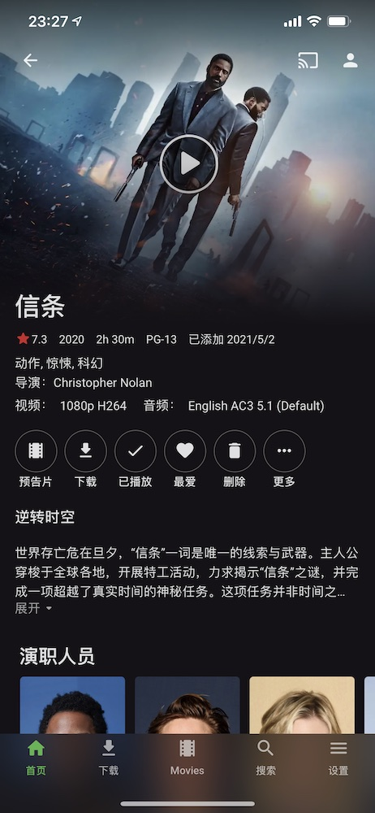
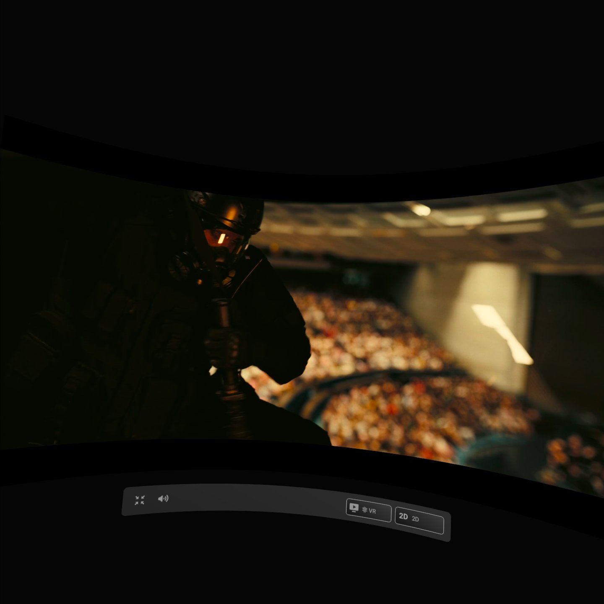
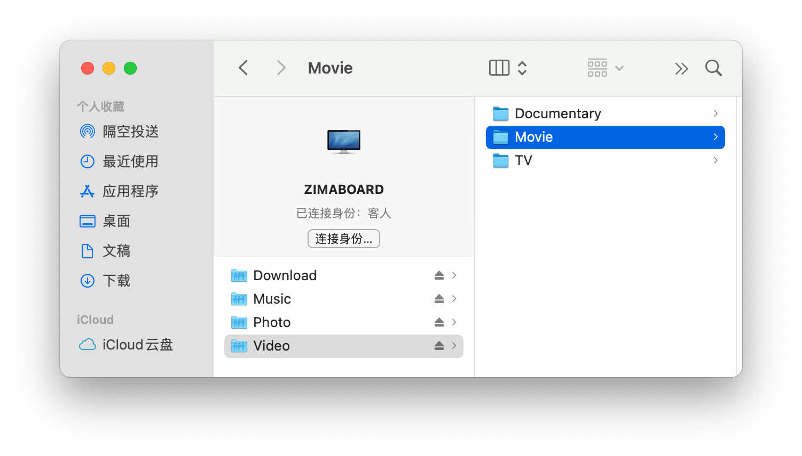
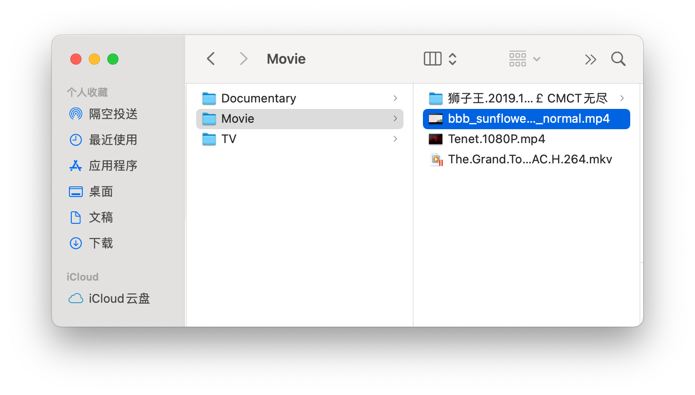
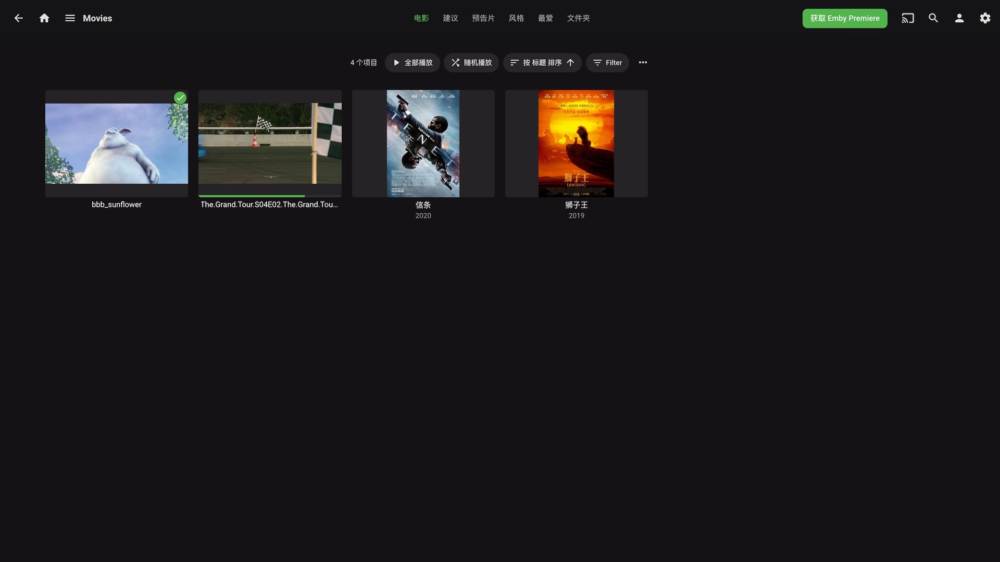

# 用 Emby 随处看大片

## 打开 Emby

打开网页浏览器，打开`http://zimaboard.local`

（如果Windows中打不开的话可以试试`http://zimaboard`）

打开后你就能看到Oasis的登陆界面：

输入用户名`admin`和密码`zimaboard`后，点击"**Sign In**"登陆。

然后我们就来到了Oasis的Dashboard了。

我们在**My Apps**中找到**Emby**然后点击它的Logo，就打开了

## 登录 Emby

进入 Emby 之后我们就可以看到选择用户的界面

选择`admin`账号，输入密码`zimaboard`，点击登录即可

完成登录之后我们就可以浏览资料库了

## 用Emby看喜欢的视频吧！

电影信息

播放页面

## 想在哪看就在哪看

Emby 提供了很多的看片途径可供选择，电脑、手机、电视、游戏主机、甚至在VR上你都可以看。

手机查看影片（iOS）

Oculus Quest 2 用浏览器看电影

你可以在[这个链接](https://emby.media/download.html)里的“Emby Apps & Devices”栏目中，查看 Emby 提供哪些平台的客户端下载

## 添加影片

### 通过 Samba 共享文件夹

我们打开共享文件夹中的`Video`文件夹，你可以添加自己的**电影**到`Move`文件夹中

这里我新增一个`Big Buck Bunny`到文件夹中

接下来我们在 Emby 的媒体库里就可以看到新上传的影片了

可以看大兔兔了～

