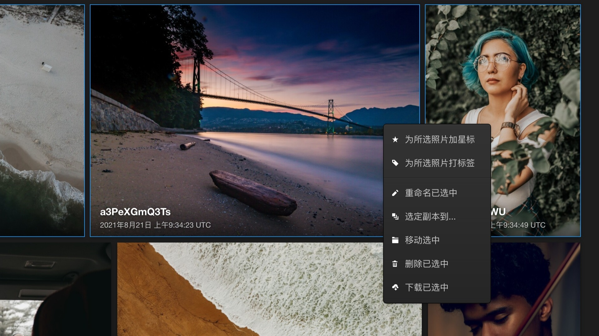

# 用 Lychee 管理你的照片

## 打开 Lychee

打开网页浏览器，打开`http://zimaboard.local`

（如果Windows中打不开的话可以试试`http://zimaboard`）

打开后你就能看到Oasis的登陆界面：

输入用户名`admin`和密码`zimaboard`后，点击"**Sign In**"登陆。

然后我们就来到了Oasis的Dashboard了。

我们在**My Apps**中找到**Lychee**然后点击它的Logo，就打开了

## 登录 Lychee

打开**Lychee**之后你就会看到一个公开相册页面，默认是没有公开相册的，所以页面是空的。

我们点击页面左上角的图标进入登录页面

输入用户名`admin`和密码`zimaboard`，然后点击**登录**

## 使用 Lychee

### 上传照片或创建相册

### 查看照片信息

### 批量整理照片

