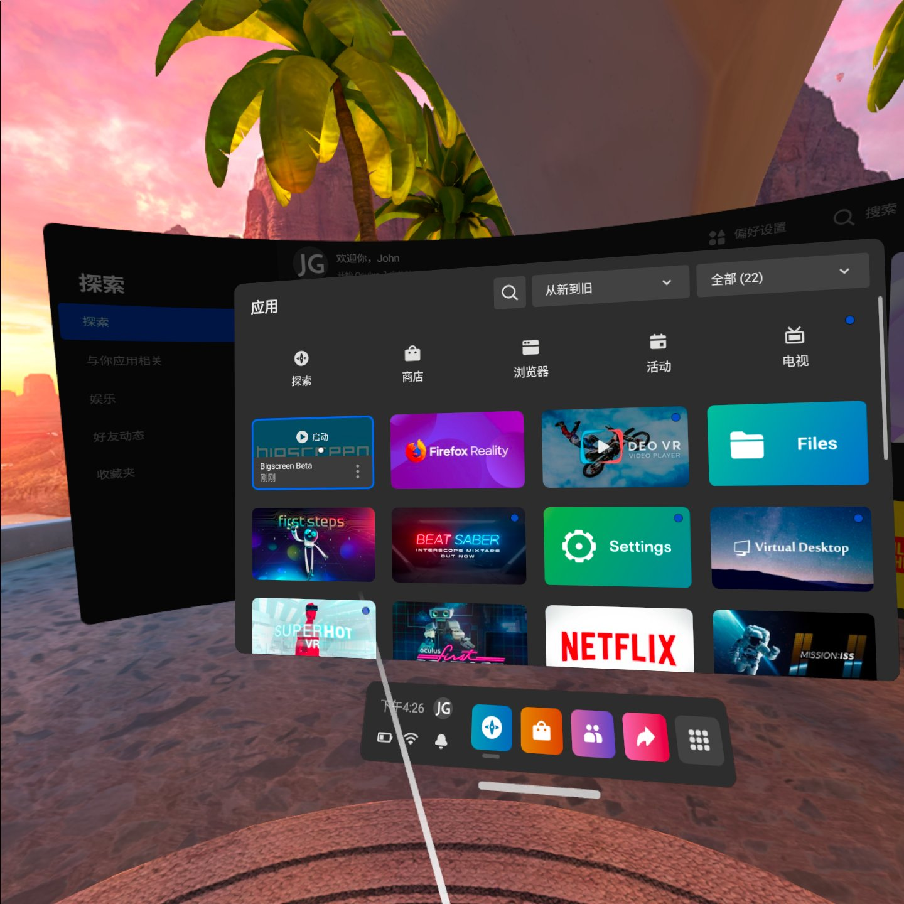
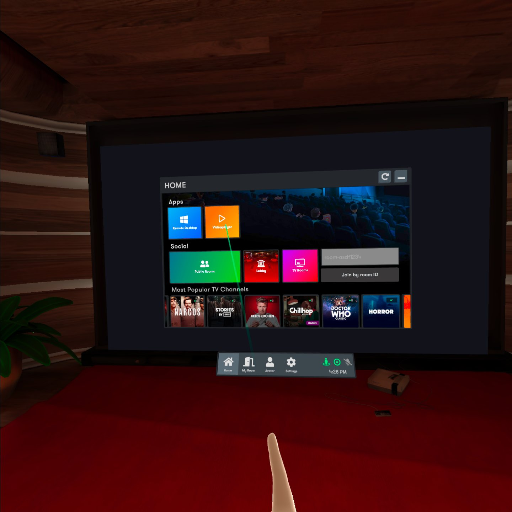
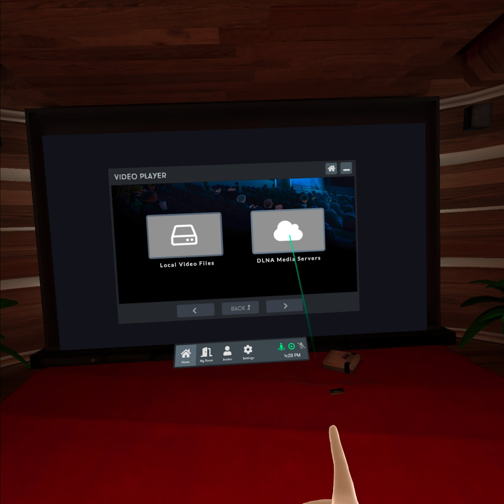
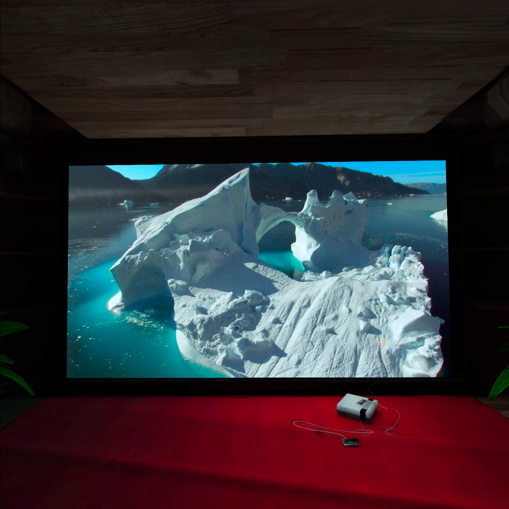

# 如果你在玩Oculus

## BigScreen访问DLNA服务器内容

除了基础的Samba局域网服务外，ZimaBoard也预部署了miniDLNA的服务，通过DLNA的服务器，Oculus可以便捷地通过多种应用访问你家庭服务器中的影片和内容
在本片教程中，我们使用Oculus上的BigScreen应用来播放影片

1. 从Oculus Store安装，打开BigScreen应用

2. 点击播放视频

3. 稍后，Oculus扫描所有本地的DLNA服务器，并选中ZimaBoard广播的DLNA服务

4. 选择你对应的媒体内容，Enjoy it! 

通过以上简单步骤，即可使用Oculus的媒体播放器，加载家庭服务器上的各种影片和内容！...先不聊了，让我看会片(~˘▾˘)~
不过用Oculus看2D影片总觉得哪里不太对，后续更新VR内容的简单教程...

### Skybox直接访问本地服务器
待撰写