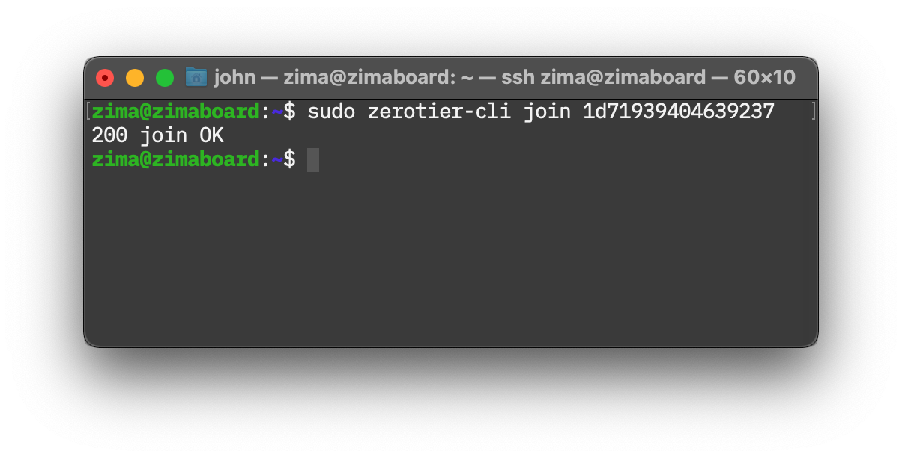

# 通过 SSH 配置 ZeroTier 网络

## 注册 ZeroTier

我们先打开ZeroTier的[官网](https://www.zerotier.com/)


在页面右上角点击  按钮进行注册


完成后你将会进入ZeroTier的[Central(控制面板)](https://my.zerotier.com/network)


## 创建网络

在控制面板中点击"**Create Network(创建网络)**"按钮，在下面的"**Your Networks(你的网络)**"列表中会自动创建一个新的随机网络ID和名称的网络。

类似这样：


::: tip
记住你的"**NETWORK ID(网络ID)**"，后面配置的时候会用到！
:::


## 让 ZimaBoard 加入 ZeroTier 网络

我们先通过 SSH 连接到 ZimaBoard 

::: details 通过 SSH 连接 ZimaBoard 的方法

打开**终端(macOS)**或**PowerShell(Windows)**，输入以下内容并按下<kbd>Enter</kbd>。

```:no-line-numbers
ssh zima@zimaboard
```

如果当前电脑是首次通过 SSH 连接 ZimaBoard 的话，，会出现类似如下的提示：

```:no-line-numbers
The authenticity of host 'zimaboard (xxx.xxx.xxx.xxx)' can't be established.
ECDSA key fingerprint is SHA256:iyEW3H75xxAxxxvyk1M3O/mMfNRxXxxx02Xebal8hgo.
Are you sure you want to continue connecting (yes/no/[fingerprint])? 
```

直接输入`yes`并按下<kbd>Enter</kbd>。


然后输入密码`zimaboard`并按下<kbd>Enter</kbd>。（输入密码时不会显示任何字符，输就完了）

:::

### 安装 ZeroTier

输入以下内容并按下<kbd>Enter</kbd>，输入密码`zimaboard`，开始安装 ZeroTier。

```:no-line-numbers
curl -s https://install.zerotier.com | sudo bash
```


等待安装完成即可。


### 加入 ZeroTier 网络

输入以下内容，将`<YourNetworkID>`替换为你的"**NETWORK ID(网络ID)**"，按下<kbd>Enter</kbd>，输入密码`zimaboard`即可。。

```:no-line-numbers
sudo zerotier-cli join <YourNetworkID>
```

指令应该和下面这个类似，只是后面的"**NETWORK ID(网络ID)**"不一样。

```:no-line-numbers
sudo zerotier-cli join 1d71939404639237
```



显示`200 join OK`即代表加入完成。


### 网络授权

回到ZeroTier的[Central(控制面板)](https://my.zerotier.com/network)

点击刚才之前加入的网络，进入控制页面，找到"**Members(成员)**"标签。


你会看到一个新加入的设备，然后在前面这列"**Auth?**"打上勾，就完成授权了。


其他设备加入网络也是一样的授权方法，简单吧？快去试试吧！

::: tip
设备后面的 "**Managed IPs**" 中记录了这个设备在 ZeroTier 网络中的 IP 地址

你需要把它记下来，或者自己设置一个好记的 IP 地址，之后通过 ZeroTier 网络访问的时候都要用到这个 IP 地址。

在其他教程中使用到的功能基本上都可以通过 ZeroTier 网络来访问，只需要将地址中`zimaboard`换成记下的这个 IP 地址即可。

也就是说`http://zimaboard`改成`http://IP`，`smb://zimaboard`改成`smb://IP`就好了。
:::

## 把你的电脑、笔记本、手机都加进来

从[ZeroTier官网](https://www.zerotier.com/download/)下载对应的客户端到你的设备上。

打开程序就可以输入网络ID，参照上面的步骤进行[网络授权](#网络授权)，即可完成加入网络。

